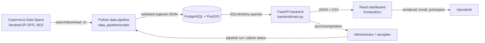
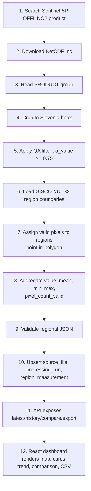
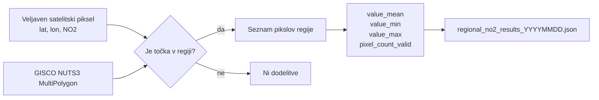
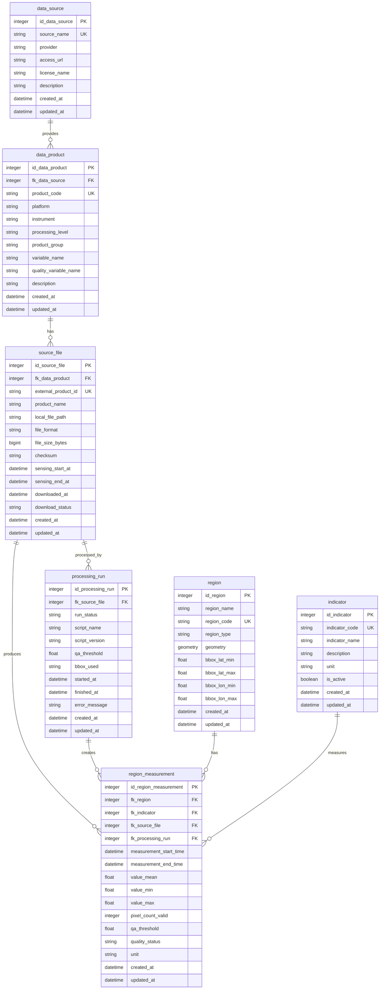
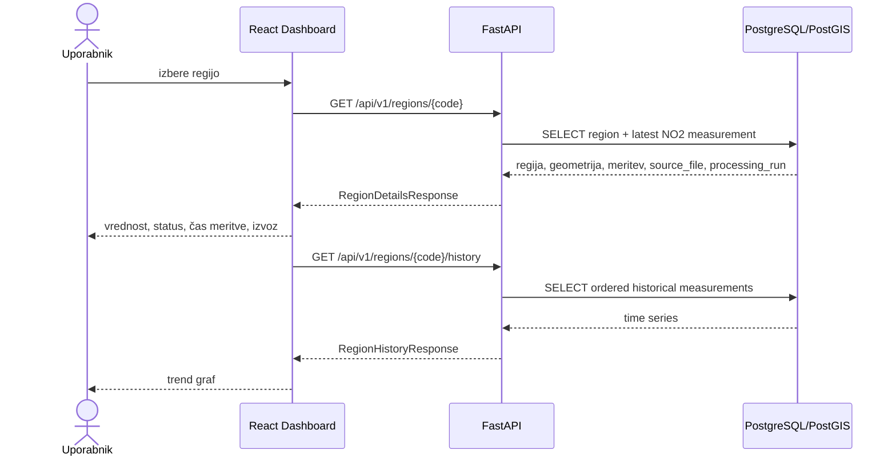
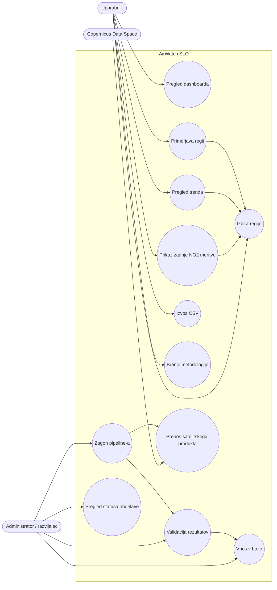
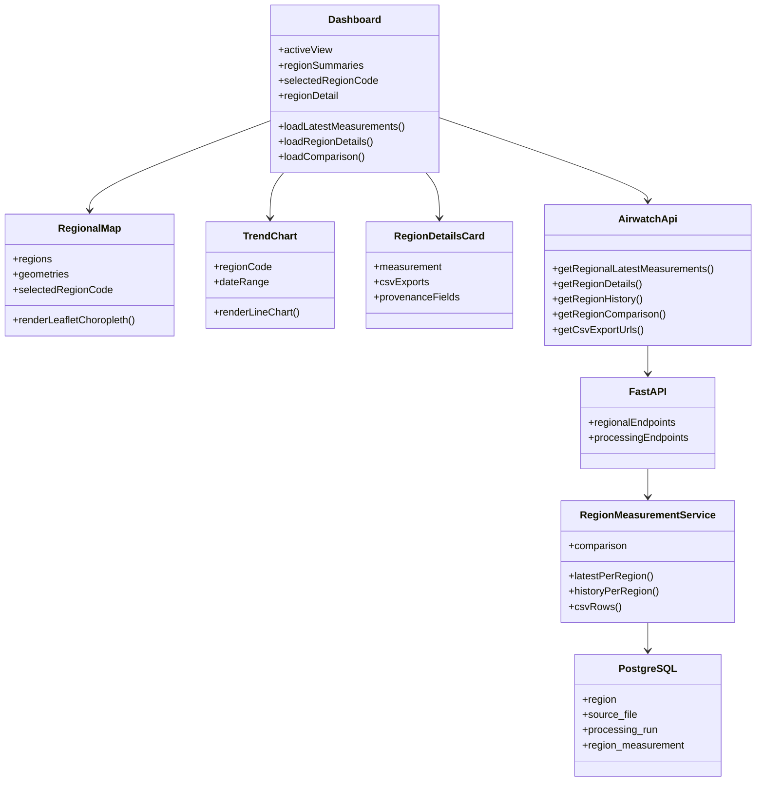
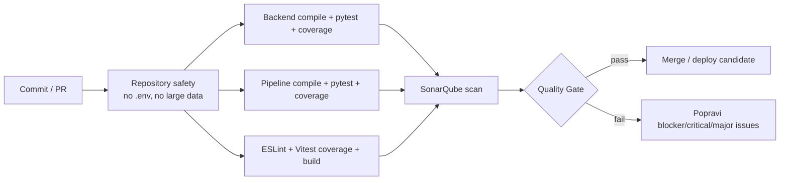
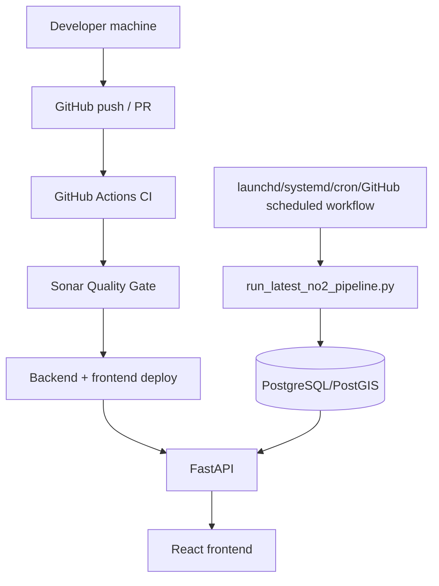

# AirWatch SLO

AirWatch SLO je spletna aplikacija za prikaz regionalnih vrednosti dušikovega
dioksida (NO₂) nad Slovenijo na podlagi satelitskih podatkov Copernicus
Sentinel-5P (instrument TROPOMI).

Aplikacija prikazuje zadnje razpoložljive obdelane NO₂ podatke, agregirane po
slovenskih statističnih regijah. Prikaz ni v realnem času in ne predstavlja
uličnih meritev kakovosti zraka.

## Povezave

- **Deployana rešitev:** https://airwatch-frontend-production.up.railway.app/
- **Jira / projektno vodenje:** https://testnastran.atlassian.net/jira/software/projects/AIRSLO/boards/34
  
## Kazalo

1. [Povzetek projekta](#povzetek-projekta)
2. [Kaj aplikacija prikazuje](#kaj-aplikacija-prikazuje)
3. [Omejitve in interpretacija](#omejitve-in-interpretacija)
4. [Tehnološki sklad](#tehnološki-sklad)
5. [Arhitektura sistema](#arhitektura-sistema)
6. [Data flow](#data-flow)
7. [Data pipeline](#data-pipeline)
8. [Podatkovni model in ER diagram](#podatkovni-model-in-er-diagram)
9. [Backend in API](#backend-in-api)
10. [Frontend](#frontend)
11. [Use case diagram](#use-case-diagram)
12. [Razredni/component diagram](#razrednicomponent-diagram)
13. [Lokalni zagon](#lokalni-zagon)
14. [Testiranje in kakovost](#testiranje-in-kakovost)
15. [SonarQube](#sonarqube)
16. [Deployment in osveževanje podatkov](#deployment-in-osveževanje-podatkov)
17. [Projektno vodenje in način dela](#projektno-vodenje-in-način-dela)
18. [Onboarding za novega razvijalca](#onboarding-za-novega-razvijalca)
19. [Struktura repozitorija](#struktura-repozitorija)
20. [Dodatna dokumentacija](#dodatna-dokumentacija)

## Povzetek projekta

AirWatch SLO prikazuje zadnjo razpoložljivo obdelano Sentinel-5P NO₂ meritev po
12 slovenskih statističnih regijah (NUTS3). Sistem iz velikega satelitskega
NetCDF produkta pripravi majhne, sledljive regionalne agregate in jih prikaže v
React dashboardu.

Osnovni tok:

```text
Sentinel-5P NO₂ produkt → Python data pipeline → PostgreSQL/PostGIS → FastAPI → React dashboard
```

Glavna vrednost projekta ni samo zemljevid, ampak celoten sledljiv proces:
satelitski produkt, QA filter, regionalna agregacija, validacija, vnos v bazo,
API, vizualizacija in izvoz podatkov.

## Kaj aplikacija prikazuje

Uporabnik lahko:

- izbere slovensko statistično regijo,
- vidi zadnjo obdelano NO₂ vrednost regije,
- vidi status kakovosti meritve (`valid`, `no_valid_pixels`,
  `processing_error`),
- vidi čas satelitskega preleta in izvorni Sentinel-5P produkt,
- primerja regije po zadnji vrednosti,
- pregleda zgodovinski trend izbrane regije,
- izvozi CSV za izbrano regijo, zgodovino regije ali vse regije,
- prebere metodologijo in omejitve,
- pogleda interno stran `#admin` za status obdelave podatkov, če je admin, se lahko tudi prijavi.

## Omejitve in interpretacija

To so namerne lastnosti sistema:

- **Ni real-time aplikacija.** Prikazuje zadnjo razpoložljivo obdelano meritev.
  Sentinel-5P OFFL produkti so objavljeni z zamikom.
- **Ni ulična meritev.** En TROPOMI piksel pokriva približno 3,5 x 5,5 km.
  Rezultat je regionalna satelitska ocena, ne meritev pri tleh.
- **Ni uradna ARSO meritev.** Podatki so satelitski stolpci NO₂
  (`mol/m²`), ne koncentracija pri tleh.
- **Manjkajoče vrednosti niso ničle.** Regija brez dovolj veljavnih pikslov
  dobi `quality_status = no_valid_pixels`, vrednosti `value_*` pa so `null`.

Interpretacija: višja vrednost pomeni več NO₂ v navpičnem stolpcu ozračja nad
regijo. Primerjave so uporabne na regionalni ravni, ne za konkretno ulico ali
naslov.

## Tehnološki sklad

| Sloj | Tehnologije | Vloga |
|---|---|---|
| Data pipeline | Python, requests, xarray, numpy, netCDF4 | prenos, branje in agregacija Sentinel-5P produkta |
| Baza | PostgreSQL 15, PostGIS, Alembic | trajno shranjevanje regij, produktov, obdelav in meritev |
| Backend | FastAPI, SQLAlchemy, Pydantic | API, validacija odgovorov, CSV izvoz |
| Frontend | React 18, Vite, Leaflet, Recharts | dashboard, zemljevid, trendi, primerjave |
| Lokalno okolje | Docker Compose | skupni zagon baze, backend in frontend |
| CI/QA | GitHub Actions, pytest, Vitest, Playwright, ESLint, SonarQube | avtomatsko preverjanje kakovosti |

## Arhitektura sistema



### Zakaj je arhitektura razdeljena

- Data pipeline je ločen od backenda, ker dela z velikimi `.nc` datotekami,
  zunanjimi poverilnicami in daljšimi obdelavami.
- Backend je namenoma bralni API za dashboard; produkcijski vnos podatkov gre
  prek pipeline/ingest skript, ne prek javnega HTTP endpointa.
- Baza hrani sledljivost: meritev je vedno povezana z regijo, indikatorjem,
  izvornim produktom in processing run zapisom.
- Frontend ne pozna SQL ali pipeline logike; uporablja samo API.

## Data flow



Pomembna odločitev: izhod pipeline-a ni raster ali velika satelitska datoteka,
ampak majhen JSON z eno vrstico na statistično regijo. To zmanjša kompleksnost
API-ja in omogoči hitro uporabniško izkušnjo.

## Data pipeline

Pipeline skripte so v `data_pipeline/scripts/`, vnos v bazo pa v
`backend/scripts/`.

| Korak | Skripta | Kaj naredi |
|---|---|---|
| Token | `get_copernicus_token.py` | preveri Copernicus poverilnice |
| Search | `search_s5p_no2_products.py` | poišče Sentinel-5P NO₂ produkte nad Slovenijo |
| Download | `download_s5p_no2_product.py` | prenese izbran `.nc` produkt |
| Inspect | `inspect_s5p_no2_structure.py` | preveri NetCDF strukturo |
| Crop/filter | `crop_filter_no2_slovenia.py` | omeji na Slovenijo in QA filter |
| Aggregate | `aggregate_no2_by_region.py` | izračuna regijske statistike |
| Validate | `validate_regional_no2_output.py` | preveri strukturo in logiko JSON izhoda |
| Ingest | `backend/scripts/ingest_regional_no2_measurements.py` | idempotentno vpiše rezultate v bazo |
| Orchestrator | `run_latest_no2_pipeline.py` | zažene celotno verigo |

### QA filter

Uporablja se `qa_value >= 0.75`. Piksli pod pragom, NaN vrednosti in slabi
retrievali niso vključeni v izračun. QA filter je tehnična kontrola kakovosti,
ne garancija znanstvene popolnosti.

### Regionalna agregacija



### Zakaj point-in-polygon

To je poenostavljena, razumljiva in testabilna metoda za MVP. Ne uporablja
uteževanja po satelitskem footprintu ali prekrivanju piksla z regijo. Omejitev
je jasno dokumentirana, ker je pomembna za interpretacijo.

## Podatkovni model in ER diagram

Glavni vir sheme so Alembic migracije v `backend/alembic/versions/`.
`database/init/` vsebuje referenčne SQL skripte, ne primarnega vira sheme.



### Sledljivost ene meritve

Vsaka vrstica `region_measurement` odgovori na vprašanja:

- za katero regijo je meritev (`fk_region`),
- kateri indikator meri (`fk_indicator`, trenutno NO₂),
- iz katere datoteke je prišla (`fk_source_file`),
- kateri zagon jo je ustvaril (`fk_processing_run`),
- kakšna je kakovost (`quality_status`, `qa_threshold`, `pixel_count_valid`),
- za kateri satelitski čas velja (`measurement_start_time`,
  `measurement_end_time`).

## Backend in API

Backend je FastAPI aplikacija v `backend/main.py`. Poslovna SQL logika je v
`backend/services/`, Pydantic sheme pa v `backend/schemas.py`.

### Glavni endpointi

| Endpoint | Namen |
|---|---|
| `GET /health` | health check |
| `GET /api/v1/regions/latest-measurements` | zadnja meritev za vsako javno regijo |
| `GET /api/v1/regions/geometries` | GeoJSON meje regij za zemljevid |
| `GET /api/v1/regions/{region_code}` | podrobnosti regije + zadnja meritev |
| `GET /api/v1/regions/{region_code}/history` | zgodovina izbrane regije |
| `GET /api/v1/regions/compare` | primerjava 2-12 regij |
| `GET /api/v1/regions/export.csv` | CSV vseh zadnjih meritev |
| `GET /api/v1/regions/{region_code}/export.csv` | CSV zadnje meritve regije |
| `GET /api/v1/regions/{region_code}/history/export.csv` | CSV zgodovine regije |
| `GET /processing/status` | zadnji in zadnji uspešni processing run |
| `GET /processing/history` | zgodovina processing runov |

### Sequence diagram: izbor regije v dashboardu



## Frontend

Frontend je React + Vite aplikacija v `frontend/`. Vsi API klici so centralno v
`frontend/src/api/airwatchApi.js`; komponente ne sestavljajo API URL-jev same,
razen prek teh helperjev.

Glavni pogledi:

- `satellite` - razlaga Sentinel-5P in približen orbitalni prikaz,
- `overview` - zemljevid Slovenije in izbrana meritev,
- `trend` - zgodovinski graf izbrane regije,
- `comparison` - primerjava zadnjih vrednosti po regijah,
- `data` - podrobnosti, sledljivost in CSV izvoz,
- `methodology` - metodologija in omejitve,
- `about` - opis projekta,
- `#admin` - interni status obdelave.

Frontend podpira:

- SL/EN/DE prevode prek `frontend/src/i18n.jsx`,
- dostopnostne nastavitve (večje besedilo, visok kontrast, manj gibanja),
- keyboard/assistive-tech fallbacke za zemljevid in primerjave,
- CSV izvoze prek backend endpointov.

## Use case diagram



## Razredni/component diagram



## Lokalni zagon

### 1. Priprava okolja

```bash
cp .env.example .env
```

V `.env` nastavi vsaj:

- `POSTGRES_PASSWORD`,
- `POSTGRES_DB`,
- `POSTGRES_USER`,
- po potrebi `COPERNICUS_USERNAME` in `COPERNICUS_PASSWORD` za pipeline.

`.env` se ne commita.

### 2. Zagon celotnega sklada

```bash
docker compose up --build
docker compose run --rm backend alembic upgrade head
```

URL-ji:

- Frontend: <http://localhost:3000>
- Backend: <http://localhost:8000>
- Health: <http://localhost:8000/health>
- Swagger docs: <http://localhost:8000/docs>

Opomba: baza je iz hosta dosegljiva na `localhost:5433`, znotraj Docker omrežja
pa na `db:5432`.

### 3. Vnos podatkov

Po migracijah je treba naložiti regije in meritve:

```bash
python backend/scripts/load_regions.py \
  --regions-file data_pipeline/reference_data/regions/raw/NUTS_RG_20M_2024_4326_LEVL_3.geojson

python backend/scripts/ingest_regional_no2_measurements.py \
  --file data_pipeline/outputs/no2_by_region/regional_no2_results.json
```

Za celotno verigo:

```bash
python data_pipeline/scripts/run_latest_no2_pipeline.py
```

## Testiranje in kakovost

Kakovost se preverja na več nivojih:



### Lokalni ukazi

Backend:

```bash
cd backend
python -m pip install -r requirements-dev.txt
python -m pytest tests
```

Data pipeline:

```bash
python -m pip install -r data_pipeline/requirements-dev.txt
python -m pytest data_pipeline/tests
```

Frontend:

```bash
cd frontend
nvm use
npm ci
npm run lint
npm test
npm run build
```

E2E:

```bash
cd frontend
npx playwright install chromium
npm run test:e2e
```

### Kaj testi preverjajo

- Backend testi preverjajo endpoint logiko, validacijo parametrov, 404/400/500
  scenarije in CSV izvoze.
- Pipeline testi uporabljajo sintetične podatke, zato ne potrebujejo pravih
  `.nc` datotek ali Copernicus poverilnic.
- Frontend testi mockajo API in preverjajo navigacijo, prevode, prikaz kartic,
  trendov, primerjav in izvozov.
- Build preveri, da se produkcijski Vite bundle sestavi.

## SonarQube

SonarQube/SonarCloud je povezan prek:

- `.github/workflows/ci.yml` (`sonarqube` job),
- `sonar-project.properties`,
- GitHub secretov/variables.

### Potrebna GitHub konfiguracija

V GitHub repozitoriju nastavi:

| Ime | Tip | Namen |
|---|---|---|
| `SONAR_TOKEN` | Secret | token za SonarCloud/SonarQube scan |
| `SONAR_ORGANIZATION` | Variable ali secret | SonarCloud organizacija |
| `SONAR_PROJECT_KEY` | Variable ali secret, opcijsko | projektni ključ; če manjka, CI uporabi ime repozitorija |

CI zdaj Sonar konfiguracijo validira. Če token ali organizacija manjka, job
pade z jasno napako. Scan čaka na Quality Gate:

```text
-Dsonar.qualitygate.wait=true
```

To pomeni, da večji Sonar problemi niso samo opozorilo; Quality Gate mora
uspeti, preden je koda sprejemljiva.

### Kaj pošiljamo v Sonar

`sonar-project.properties` vključuje:

- source: `backend`, `data_pipeline/scripts`, `frontend/src`,
- teste: `backend/tests`, `data_pipeline/tests`, `frontend/tests`,
- Python coverage XML,
- JavaScript LCOV,
- izključitve za `node_modules`, `.venv`, `dist`, Alembic migracije, surove
  podatke in velike outpute.

### Kako ravnati s Sonar problemi

Prioriteta odpravljanja:

1. **Blocker/Critical** - vedno popraviti pred oddajo.
2. **Major** - popraviti, razen če je lažni pozitivni rezultat in je utemeljeno
   označen v Sonarju.
3. **Code smells/Minor** - popraviti, kadar vplivajo na razumljivost ali
   vzdrževanje.

Tipični popravki v tem projektu:

- ne logiraj neprečiščenih user inputov,
- ne vračaj lažnih ničel za manjkajoče podatke,
- podvajanje i18n ključev izključi iz CPD, ker je ponavljanje po jezikih
  namerno,
- testne in generated mape izključi iz source analize,
- za SQL uporablja parametrizirane poizvedbe.

## Deployment in osveževanje podatkov

Frontend in backend sta pripravljena za Docker/Railway deploy. Lokalno se
zaženejo prek Docker Compose.



Osveževanje podatkov ni real-time. Priporočena produkcijska logika je dnevni
zagon, ker OFFL Sentinel-5P produkti prihajajo z zamikom in pogostejše
preverjanje večinoma ne prinese novih podatkov.

Za razporejanje glej `data_pipeline/automation/README.md` in
`.github/workflows/refresh-no2.yml`.

## Projektno vodenje in način dela

Projekt je voden kot inkrementalni razvoj po sprintih:

1. dokaz koncepta nad bbox Slovenije,
2. uvedba NUTS3 regij,
3. validacija regionalnega pipeline-a,
4. backend API,
5. React dashboard,
6. zgodovina, primerjave, CSV izvoz,
7. admin status, CI, SonarQube in dokumentacija.

Pravila dela:

- spremembe sheme gredo prek Alembic migracij,
- novi uporabniški teksti gredo skozi `frontend/src/i18n.jsx`,
- API spremembe morajo imeti Pydantic shemo in test,
- pipeline izhodi se validirajo pred vnosom v bazo,
- `.env`, `.nc`, `.zip`, raw GIS podatki in veliki outputi se ne commitajo,
- PR mora skozi CI in Sonar Quality Gate.

## Onboarding za novega razvijalca

Priporočen vrstni red branja:

1. Preberi ta README do konca.
2. Zaženi `docker compose up --build`.
3. Odpri `http://localhost:8000/docs` in preveri API.
4. Odpri `http://localhost:3000` in klikni skozi vse poglede.
5. Preberi `backend/main.py` in `backend/services/region_measurement_service.py`.
6. Preberi `data_pipeline/scripts/run_latest_no2_pipeline.py`.
7. Preberi Alembic migracije v `backend/alembic/versions/`.
8. Zaženi teste za sloj, ki ga spreminjaš.

Najpomembnejše datoteke:

| Datoteka | Zakaj je pomembna |
|---|---|
| `backend/main.py` | javni API, CSV export, processing status |
| `backend/services/region_measurement_service.py` | SQL logika za meritve |
| `backend/schemas.py` | Pydantic pogodbe API odgovorov |
| `data_pipeline/scripts/aggregate_no2_by_region.py` | regionalna agregacija |
| `data_pipeline/scripts/validate_regional_no2_output.py` | validacija JSON izhoda |
| `backend/scripts/ingest_regional_no2_measurements.py` | idempotenten vnos v bazo |
| `frontend/src/pages/Dashboard.jsx` | orkestracija dashboard podatkov |
| `frontend/src/api/airwatchApi.js` | centralni API helperji |
| `frontend/src/i18n.jsx` | prevodi in UI besedila |
| `.github/workflows/ci.yml` | CI, coverage, SonarQube |
| `sonar-project.properties` | Sonar konfiguracija |

## Struktura repozitorija

```text
airwatch-slo/
├── backend/                    FastAPI, SQLAlchemy, Alembic, API testi
│   ├── main.py                 API endpointi
│   ├── services/               SQL/service logika
│   ├── schemas.py              Pydantic response modeli
│   ├── scripts/                ingest/load skripte
│   └── alembic/versions/       migracije baze
├── data_pipeline/              Sentinel-5P obdelava
│   ├── scripts/                search/download/aggregate/validate/orchestrator
│   ├── tests/                  sintetični pipeline testi
│   ├── automation/             launchd/systemd/cron primeri
│   └── outputs/, sample_data/  gitignored runtime podatki
├── database/                   referenčni SQL in diagrami
├── frontend/                   React + Vite dashboard
│   ├── src/components/         UI komponente
│   ├── src/pages/              dashboard/admin strani
│   ├── tests/ui/               Vitest testi
│   └── tests/e2e/              Playwright testi
├── docs/                       dodatni poglobljeni dokumenti
├── .github/workflows/          CI in scheduled pipeline workflow
├── docker-compose.yml          lokalni stack
├── sonar-project.properties    Sonar konfiguracija
└── README.md                   glavni projektni dokument
```

## Dodatna dokumentacija

README je glavni dokument. Za še več podrobnosti so na voljo:

| Dokument | Vsebina |
|---|---|
| `docs/01_project_overview.md` | kratek pregled projekta |
| `docs/02_architecture.md` | arhitektura in komponente |
| `docs/03_data_pipeline.md` | podroben pipeline |
| `docs/04_api_documentation.md` | API endpointi |
| `docs/05_deployment_guide.md` | lokalni in Railway deploy |
| `docs/06_developer_handover.md` | predaja razvijalcu |
| `docs/07_limitations_and_methodology.md` | metodologija in omejitve |
| `docs/08_final_architecture_diagram.md` | dodatni arhitekturni diagram |
| `database/diagrams/` | ER in use-case diagrami |
| `docs/archive/` | zgodovinski sprint zapisi in runbooki |

**Ekipa:** Maida Ćivić, Matija Čoh, Aleš Fon Cafnik
