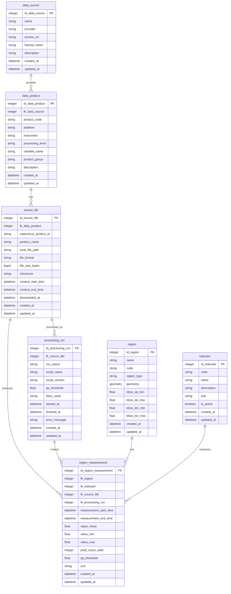

# AirWatch SLO MVP ER diagram

Ta ER diagram prikazuje MVP podatkovni tok od Copernicus Sentinel-5P NO2 produktov do obdelanih regionalnih meritev za AirWatch SLO dashboard.

## Opis tabel

`region` hrani slovenske regije, ki jih lahko uporabnik izbere v dashboardu. MVP se lahko začne z okvirjem za celotno Slovenijo, kasneje pa ga je mogoče zamenjati ali razširiti z uradnimi geometrijami regij za prikaz trendov in primerjavo regij.

`indicator` definira merljive kazalnike kakovosti zraka. V Sprintu 1 vsebuje NO2 z enoto `mol/m²`; tabela omogoča dodajanje prihodnjih kazalnikov brez spremembe merilnega modela.

`data_source` hrani metapodatke o viru podatkov, na primer Copernicus Data Space, vključno s ponudnikom, dostopnim URL-jem, licenco in opisom.

`data_product` hrani metapodatke o Sentinel-5P NO2 produktu in je povezana s tabelo `data_source`. Podatkovno odkrivanje je potrdilo, da NetCDF skupina `PRODUCT` vsebuje `latitude`, `longitude`, `nitrogendioxide_tropospheric_column` in `qa_value`; spremenljivka NO2 je predstavljena s stolpcem `variable_name`.

`source_file` hrani metapodatke za eno preneseno datoteko Copernicus produkta, vključno s Copernicus ID-jem produkta, imenom produkta, lokalno potjo, formatom datoteke, velikostjo datoteke, kontrolno vsoto in časovnim intervalom vsebine. Prenesene datoteke `.nc` in `.zip` morajo ostati zunaj Gita.

`processing_run` sledi vsaki izvedbi obdelovalnega skripta nad izvorno datoteko. Beleži status, identiteto skripta, `qa_threshold`, uporabljeni bbox, časovne oznake in morebitno sporočilo o napaki, kar omogoča ponovljivost rezultatov.

`region_measurement` hrani obdelane regionalne statistike, ki jih uporablja dashboard: `value_mean`, `value_min`, `value_max`, `pixel_count_valid`, `qa_threshold` in `unit`. Vsaka vrstica povezuje regijo, kazalnik, izvorno datoteko in obdelovalni zagon za določen časovni interval meritve.

## Opis povezav

En `data_source` lahko zagotavlja več zapisov `data_product`. En `data_product` ima lahko več prenesenih zapisov `source_file`. Ena datoteka `source_file` je lahko obdelana v več zapisih `processing_run`, na primer ob spremembi skripta ali pragov kakovosti.

Vsak `processing_run` lahko ustvari več zapisov `region_measurement`, na primer en zapis za vsako slovensko regijo. Vsak `region_measurement` pripada natanko eni regiji `region` in enemu kazalniku `indicator`, kar podpira poizvedbe za zadnjo meritev v dashboardu, zgodovinske trende in primerjavo regij.

Za poizvedbo zadnje vrednosti v dashboardu se `region_measurement` filtrira po `fk_region` in `fk_indicator`, uredi padajoče po `measurement_end_time`, nato pa se prebere najnovejša obdelana vrstica.
