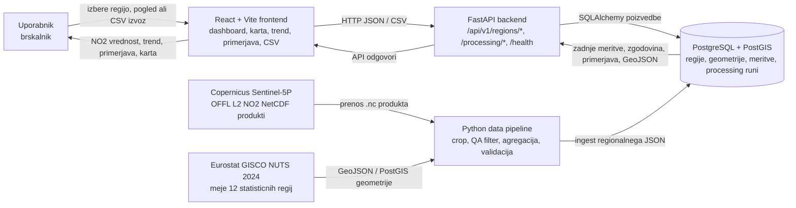

# 08 - Finalni arhitekturni diagram in uporabniska navodila

Ta dokument zdruzuje finalni arhitekturni pogled AirWatch SLO in kratek vodic za
uporabnika dashboarda.

## Finalni arhitekturni diagram

## Pretok podatkov

1. Pipeline prenese ali uporabi izbran Sentinel-5P OFFL L2 NO2 produkt.
2. Podatke omeji na Slovenijo, uporabi kakovostni filter `qa_value >= 0.75` in
   veljavne piksle dodeli statisticnim regijam.
3. Za vsako od 12 regij izracuna `value_mean`, `value_min`, `value_max`,
   `pixel_count_valid`, status kakovosti in podatke o izvoru.
4. Validiran regionalni JSON se vnese v PostgreSQL/PostGIS bazo skupaj s
   sledljivostjo do `source_file` in `processing_run`.
5. FastAPI bere najnovejse meritve, zgodovino, primerjave in geometrije iz baze.
6. React dashboard prikaze izbrano regijo, karto, zadnjo NO2 vrednost, trend,
   primerjavo regij in CSV izvoz.

## Kratka navodila za uporabo dashboarda

### Izbira regije

Na pogledu **Pregled** izberi statisticno regijo v izbirniku ali klikni regijo
na karti. Obe izbiri sta povezani: klik na karti spremeni izbrano regijo, enako
kot izbor v spustnem seznamu.

### Razumevanje NO2 vrednosti

Glavna kartica prikazuje zadnjo razpolozljivo obdelano NO2 vrednost za izbrano
regijo. Vrednost je regionalna satelitska ocena v `mol/m2`, ne meritev v realnem
casu in ne meritev na ravni ulice. Status **Veljavno** pomeni, da je imela regija
dovolj veljavnih pikslov po kakovostnem filtru. Status **Ni podatkov** pomeni, da
je bil produkt obdelan, vendar regija ni imela dovolj veljavnih pikslov; to ni
vrednost 0.

### Trend

V pogledu **Zgodovinski trend** izberi regijo in po potrebi nastavi zacetni ter
koncni datum. Graf prikazuje povprecne NO2 vrednosti skozi cas za izbrano regijo.
Za trend sta potrebni vsaj dve meritvi; manjkajoce tocke pomenijo, da za tisti
casovni interval ni bilo veljavnih pikslov.

### Primerjava regij

V pogledu **Primerjava regij** so zadnje razpolozljive vrednosti razvrscene od
najvisje proti najnizji. Regije brez veljavne vrednosti so prikazane posebej kot
brez podatkov. Klik na vrstico primerjave izbere isto regijo tudi za ostale
poglede dashboarda.

### Karta

Karta prikazuje 12 slovenskih statisticnih regij. Barva regije oznacuje status
kakovosti zadnje meritve: veljavna meritev, brez veljavnih pikslov ali napaka
obdelave. Izbrana regija je vizualno poudarjena.

### CSV izvoz

V pogledu **Podatki & izvoz** izberi regijo in klikni **Izvozi CSV**. Izvoz
vsebuje zadnjo meritev izbrane regije, vkljucno z vrednostjo, statusom kakovosti,
casom meritve, stevilom veljavnih pikslov, QA pragom in sledljivostjo do
Sentinel-5P produkta oziroma processing runa.

### Dostopnost

V stranskem meniju je razdelek **Dostopnost** z nastavitvami za vecje besedilo,
visok kontrast in manj gibanja. Nastavitve se shranijo v brskalnik in ostanejo
vklopljene pri naslednjem obisku aplikacije.
